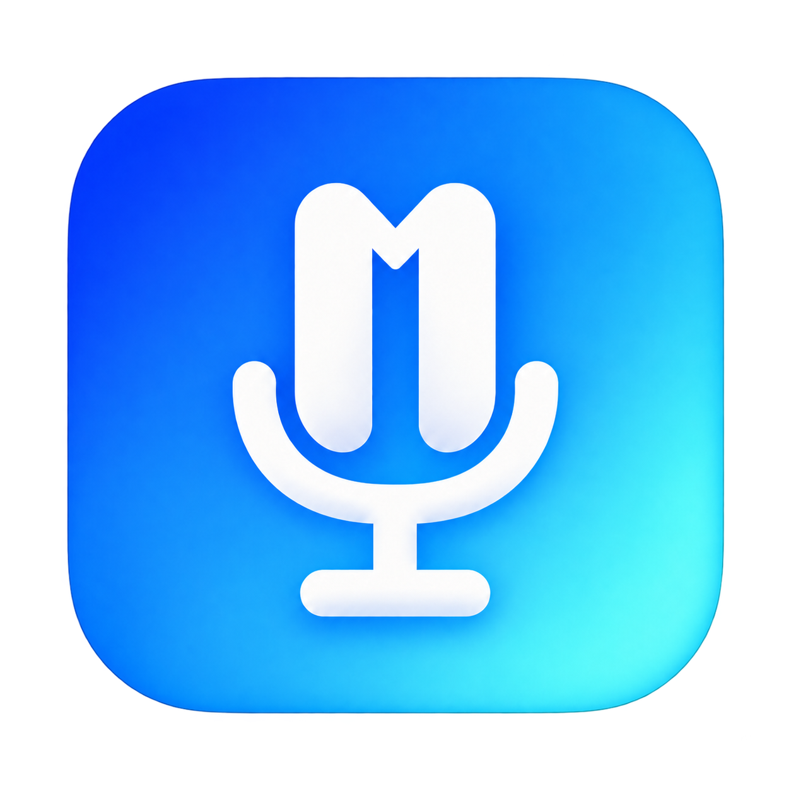
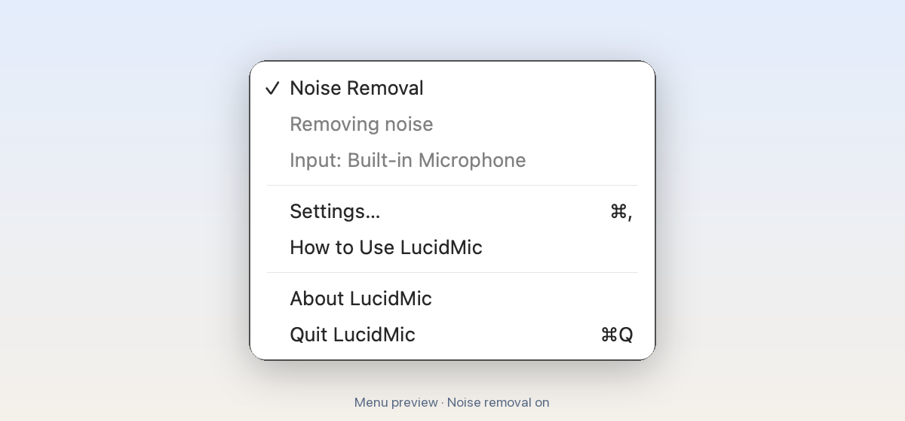

<p align="center">
  
</p>

<h1 align="center">LucidMic</h1>

<p align="center">
  Your voice. Minus the noise.<br>
  Free, on-device AI noise removal for your Mac. One click in the menu bar.
</p>

<p align="center">
  <a href="https://github.com/sultanovazamat/LucidMic/releases/latest"></a>
  <a href="https://github.com/sultanovazamat/LucidMic/actions/workflows/ci.yml"></a>
  
  
  <a href="LICENSE"></a>
</p>

<p align="center">
  <a href="https://github.com/sultanovazamat/LucidMic/releases/download/v1.0.1/LucidMic-1.0.1.dmg"><b>Download LucidMic for Mac</b></a>
</p>

**Development checkout: 1.0.2 (unreleased).** The download above is 1.0.1.
The usage and build instructions below describe this checkout; see the
[1.0.2 changes](docs/releases/1.0.2.md).

## Hear the difference

Real people speaking while typing, in a café, and around office noise.
These complete Microsoft DNS Challenge recordings are processed with the
1.0.2 candidate's actual engine. No TTS, added noise, or level normalization.

Press Play, then unmute using the speaker icon. MP4 previews use compressed
AAC audio; the WAV links provide lossless files.

| Recording | Duration | Before | After |
| --- | ---: | --- | --- |
| Keyboard typing | 6.32 s | <video src="https://github.com/user-attachments/assets/b52c68f3-a056-4ab8-b7b3-fe211a2938bb" controls></video><br>[Original WAV](docs/demo/audio/typing-original.wav) | <video src="https://github.com/user-attachments/assets/7e278cbb-e95b-439e-85b5-e570487697c8" controls></video><br>[LucidMic WAV](docs/demo/audio/typing-lucidmic.wav) |
| Café conversation | 5.66 s | <video src="https://github.com/user-attachments/assets/eda32031-7e03-41b1-bc4f-7101d0ff29da" controls></video><br>[Original WAV](docs/demo/audio/cafeteria-original.wav) | <video src="https://github.com/user-attachments/assets/787b3730-9d39-4810-b831-d1ca99109047" controls></video><br>[LucidMic WAV](docs/demo/audio/cafeteria-lucidmic.wav) |
| Copier | 5.00 s | <video src="https://github.com/user-attachments/assets/f4036c46-e371-4b2a-8180-82bc7128c5c9" controls></video><br>[Original WAV](docs/demo/audio/copier-original.wav) | <video src="https://github.com/user-attachments/assets/9aed777b-d261-41f9-8547-109e18821b4e" controls></video><br>[LucidMic WAV](docs/demo/audio/copier-lucidmic.wav) |
| Open office | 5.64 s | <video src="https://github.com/user-attachments/assets/b9eb2fbf-38e5-48e3-b095-c3dec8fdb441" controls></video><br>[Original WAV](docs/demo/audio/office-original.wav) | <video src="https://github.com/user-attachments/assets/572125b4-e169-4cee-a847-cba16b8133ca" controls></video><br>[LucidMic WAV](docs/demo/audio/office-lucidmic.wav) |
| Clatter | 14.28 s | <video src="https://github.com/user-attachments/assets/e38c2d60-d971-425e-b8f2-2b54b2ca4fbd" controls></video><br>[Original WAV](docs/demo/audio/clatter-original.wav) | <video src="https://github.com/user-attachments/assets/becd82bb-aa0c-4101-b472-f5849822f72b" controls></video><br>[LucidMic WAV](docs/demo/audio/clatter-lucidmic.wav) |
| Quiet-room control | 5.16 s | <video src="https://github.com/user-attachments/assets/8c6c4a7d-2ce7-40f5-84bf-9e249eca37aa" controls></video><br>[Original WAV](docs/demo/audio/quiet-original.wav) | <video src="https://github.com/user-attachments/assets/75e8bd83-be30-4e13-a6be-12a4618af3ae" controls></video><br>[LucidMic WAV](docs/demo/audio/quiet-lucidmic.wav) |

The sources are 16 kHz recordings; processed files are saved at 48 kHz with
the engine delay removed. These illustrate offline processing. The copier
example retains a small amount of output clipping.
Audio: Microsoft and DNS Challenge contributors, [CC BY 4.0](docs/demo/LICENSE-audio.txt).
[Source credits, measurements, and reproduction steps](docs/demo/README.md).

<picture>
  <source media="(prefers-color-scheme: dark)" srcset="docs/assets/hero-dark.png">
  
</picture>

## Why it exists

Calls do not wait for a quiet room. Fans, keyboards and background noise can
follow you into every meeting. LucidMic cleans your microphone before the
sound reaches your call app, so you control it from one place.

## What it does

- **Reduces background noise.** A local speech-enhancement model cleans your
  microphone in real time. Results depend on your microphone and environment.
- **Works across your call apps.** Apps using the system-default input receive
  the cleaned audio. If you picked a specific microphone in an app, choose
  *LucidMic Microphone* there instead.
- **Lets you hear the difference.** Click **Noise Removal** during a call or recording.
  Turning noise removal off passes your original audio through without
  disconnecting the virtual microphone.
- **Uses the input you choose.** Select a physical microphone in Settings, and
  choose its channel when using an audio interface with multiple inputs.
- **Stays in the menu bar.** One menu command, a status line, and optional launch at
  login. Quitting restores your physical microphone as the default.
- **Installs its own microphone.** Approve the driver installation once. Remove
  it later from the same menu.

## Privacy

- Audio processing runs entirely on your Mac. Audio is not uploaded.
- The model and inference libraries are included in the download. The installed
  app works offline and does not need to fetch a model on first launch.
- No account, subscription or analytics.
- LucidMic uses your microphone, which macOS asks you to allow under
  **Privacy & Security → Microphone**.

## Install

You need a Mac with Apple silicon and macOS 14 Sonoma or later.

1. Download [LucidMic-1.0.1.dmg](https://github.com/sultanovazamat/LucidMic/releases/download/v1.0.1/LucidMic-1.0.1.dmg)
   and drag LucidMic into Applications.
2. Open it. LucidMic is not notarised yet, so macOS may stop the first launch.
   Open **System Settings → Privacy & Security** and click **Open Anyway**
   after trying to open the app.
3. Click the waveform in your menu bar and enable **Noise Removal**. Allow
   microphone access and approve the one-time driver installation.

Install before joining a call: installing the driver restarts the macOS audio
service. In apps where you selected a microphone manually, choose **LucidMic
Microphone** in their audio settings.

## Using it

Click the waveform in the menu bar:

- **Noise Removal** — a checkmark means cleaning is on. Uncheck it to pass your
  original audio through while keeping the virtual microphone connected.
  This does not mute the microphone.
- The status reads **Not running**, **Removing noise**, or **Passing original
  audio**. While routing, the next line shows your actual input microphone.
- **Settings…** (`⌘,`) — choose your **Microphone** and, when available, its
  **Channel**; manage **Launch at Login** and **Remove Virtual Microphone…**.
  Removal asks for confirmation before stopping audio routing.
- **How to Use LucidMic** — opens a short guide that works offline.
- **About LucidMic** — shows the app's version and information.
- **Quit LucidMic** (`⌘Q`) — stops routing and restores your physical microphone
  as the default.

Launch at Login opens the app; noise removal starts when you enable it. Removing
the virtual microphone leaves LucidMic installed and restarts the audio service.
Enabling Noise Removal later sets the microphone up again.

In Settings, **Automatic** chooses an available physical microphone. Selecting a
microphone or channel while routing briefly restarts the audio connection and
keeps your Noise Removal setting, including original-audio mode.

If a microphone disconnects or its audio configuration changes incompatibly,
LucidMic stops routing and shows an error. Reconnect it or choose another input,
then turn on **Noise Removal** to retry. If macOS cannot restore a physical input,
select your microphone in **System Settings → Sound → Input**.

Inputs must support **48 kHz** audio with buffers of **512 frames or fewer**.
LucidMic checks the configuration before starting and reports an error when an
input cannot use these settings; choose another microphone or audio mode.

Nearby people talking and music vocals may remain: the model preserves speech
and does not identify a particular speaker. Use headphones so your call
partner's voice does not feed back through your microphone. For a comparison,
try turning off your call app's own noise suppression.

If Spotlight cannot find LucidMic, open it from Applications. Check Spotlight's
search-privacy settings and, if necessary,
[reindex the Applications folder](https://support.apple.com/en-us/102321).
LucidMic does not show a Dock icon.

## How it works

A native AppKit menu and SwiftUI Settings control a C audio engine. The audio callback moves
samples through ring buffers; a worker thread runs the noise-removal model.
A customised BlackHole driver makes the result available as a microphone.

```text
Physical microphone ──▶ DPDFNet2 ──▶ LucidMic Microphone ──▶ Your call app
                         48 kHz
                       on your Mac
```

[sherpa-onnx](https://github.com/k2-fsa/sherpa-onnx) and ONNX Runtime run the
[DPDFNet2](https://github.com/ceva-ip/DPDFNet) model. The engine adds **72 ms**
of delay; your devices and call app can add more. The same engine is
used by the app, the file-processing tool, and the tests.

## Build from source

With full Xcode and Swift 6 or later on an Apple silicon Mac, plus
[uv](https://docs.astral.sh/uv/) and [ShellCheck](https://www.shellcheck.net/):

```sh
git clone https://github.com/sultanovazamat/LucidMic.git
cd LucidMic
scripts/check.sh          # pinned dependencies, format/lint, build, tests
scripts/build.sh 1.0.2    # local candidate DMG, corresponding source, and checksums
```

Select Xcode as your active developer directory. The build downloads pinned
dependencies and verifies their checksums. The **Prepare release** workflow
builds the same artifacts and creates a draft release.

To regenerate the menu previews, icon, and installer/repository artwork:

```sh
scripts/render-menu.sh
uv run --no-project --with-requirements requirements-dev.txt python scripts/make-art.py
```

The README images are labelled previews rendered from the real menu commands
with a sample microphone. They illustrate the layout without recording audio;
macOS supplies the installed app's menu appearance.

For the offline file-processing tool, run `swift run lucidmic-file input.wav output.wav`.
It mixes all input channels into mono, converts to 48 kHz, and preserves the
recording's duration and ending without adding the live engine's delay.
The source layout and release steps are in [CONTRIBUTING.md](CONTRIBUTING.md).
Runtime build provenance is in [docs/runtime-build.md](docs/runtime-build.md).

## Contributing

Issues and focused pull requests are welcome. [CONTRIBUTING.md](CONTRIBUTING.md)
explains the code layout and checks. See [CHANGELOG.md](CHANGELOG.md) for releases.

## Credits

- [DPDFNet2](https://github.com/ceva-ip/DPDFNet) by Ceva — noise-removal model.
- [sherpa-onnx](https://github.com/k2-fsa/sherpa-onnx) — speech-enhancement API.
- [ONNX Runtime](https://github.com/microsoft/onnxruntime) by Microsoft — model inference.
- [BlackHole](https://github.com/ExistentialAudio/BlackHole) by Existential Audio — virtual microphone.

Full dependency [licences and notices](Resources/THIRD_PARTY_NOTICES.txt) ship
with the app, including those for components embedded in the runtime. Matching
driver and runtime source archives accompany each release; see
[runtime build details](docs/runtime-build.md) and [packaging tools](CONTRIBUTING.md#releases).

## Licence

[GPL-3.0](LICENSE) © 2026 Azamat Sultanov
