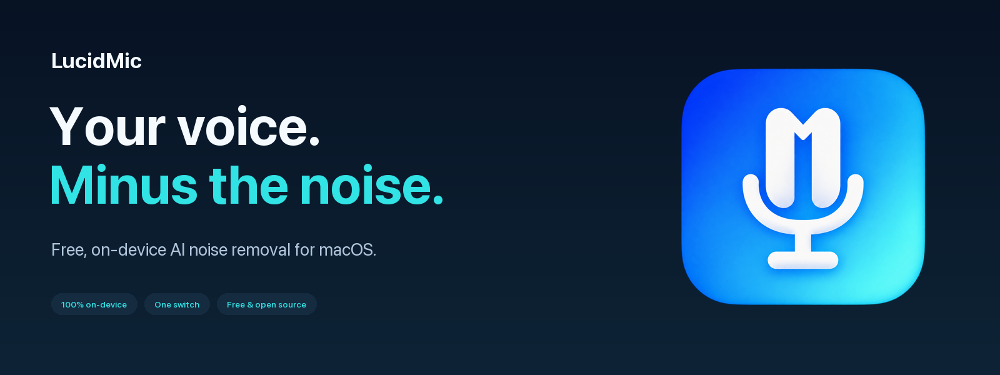
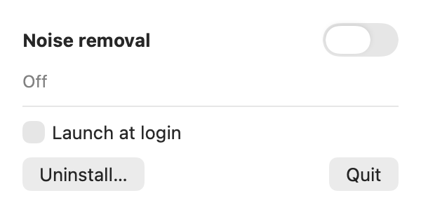

<p align="center">
  
</p>

<p align="center">
  <a href="https://github.com/sultanovazamat/LucidMic/releases/latest"></a>
</p>

<p align="center">
  <a href="https://github.com/sultanovazamat/LucidMic/actions/workflows/ci.yml"></a>
  
  
  <a href="LICENSE"></a>
</p>

<p align="center"><strong>A quieter microphone. A clearer conversation.</strong><br>
Free, on-device AI noise removal for your Mac. One switch in your menu bar.<br>
No account. No subscription. No audio uploads.</p>

## Get started

**Requires an Apple silicon Mac (M1 or newer) running macOS 14 Sonoma or later.**

1. **[Download LucidMic 1.0.0](https://github.com/sultanovazamat/LucidMic/releases/download/v1.0.0/LucidMic-1.0.0.dmg)**, open the DMG, and drag **LucidMic** into **Applications**.
2. Open LucidMic. This release is **not notarized**: if macOS blocks it, open **System Settings → Privacy & Security → Open Anyway** after the first launch attempt.
3. Click the waveform in your menu bar and turn **Noise removal** on. Allow microphone access and approve the one-time microphone-driver installation.

Apps using your **system-default microphone** now receive the cleaned audio. If you
selected a microphone explicitly in Zoom, Meet, Teams, FaceTime, or another app,
choose **LucidMic Microphone** in that app's audio settings.

> Driver installation restarts the macOS audio service. Install before joining a call.

<p align="center">
  
</p>

## Small switch. Useful difference.

| | |
| --- | --- |
| **Less background noise** | Reduces steady noise and many everyday sounds, including fans and keyboard noise. Results depend on the microphone and environment. |
| **Private by design** | The model and inference runtime ship inside the app. Audio processing runs locally and works offline. |
| **Switch it mid-call** | Toggle noise removal while the virtual microphone stays connected. Off passes your original audio through. |
| **Fits your Mac** | Native SwiftUI menu-bar app, optional launch at login, and automatic restoration of your physical microphone when you quit. |
| **Free and open source** | Inspect, build, modify, and share it under GPL-3.0. |

The switch controls **noise removal**, not microphone muting. Quit LucidMic to stop
routing and restore your physical mic as the default.

## How it works

```text
Your microphone → DPDFNet2 noise removal → LucidMic Microphone → Your call app
                         on your Mac
```

LucidMic processes 48 kHz audio with [DPDFNet2](https://github.com/ceva-ip/DPDFNet),
using [sherpa-onnx](https://github.com/k2-fsa/sherpa-onnx) and ONNX Runtime. A customized
[BlackHole](https://github.com/ExistentialAudio/BlackHole) driver exposes the cleaned
audio as a microphone. The engine buffers **70 ms** of audio; device and call-app
buffering can add further delay.

Nearby people talking and music vocals may remain: the model preserves speech and
does not identify a particular speaker. Use headphones to avoid sending your call
partner's voice back through the microphone. For comparison, try disabling the call
app's own noise suppression.

## Troubleshooting

- **Cannot find LucidMic in Spotlight?** Open it from `/Applications` once. Check
  **System Settings → Spotlight** and its search-privacy exclusions. If needed,
  [reindex the Applications folder](https://support.apple.com/en-us/102321).
  LucidMic lives in the menu bar and does not show a Dock icon.
- **Your call still uses the original mic?** Select **LucidMic Microphone** in the
  call app, or choose its system-default input setting.
- **No audio?** Allow microphone access in **Privacy & Security → Microphone**,
  then quit and reopen LucidMic. Check that your physical microphone works first.
- **Want to remove it?** Choose **Uninstall…** in LucidMic's menu, approve driver
  removal, quit, and delete LucidMic from Applications.

## Build from source

Use an Apple silicon Mac, **full Xcode with Swift 6 or later**, [uv](https://docs.astral.sh/uv/),
and [ShellCheck](https://www.shellcheck.net/). Select Xcode as your active developer
directory. Downloads happen during the build; the installed app works offline.

```sh
git clone https://github.com/sultanovazamat/LucidMic.git
cd LucidMic
scripts/check.sh          # fetch pinned dependencies, format/lint, build, test
scripts/build.sh 1.0.0    # dist/LucidMic-1.0.0.dmg + driver source + checksums
```

To regenerate the app icon, README banner, and installer artwork:

```sh
uv run --no-project --with-requirements requirements-dev.txt python scripts/make-art.py
```

The committed PNG is the logo master. See [the brand notes](docs/assets/README.md).
For the file-processing CLI, run `swift run lucidmic-file` to see usage.

## Contributing and credits

Bug reports and focused pull requests are welcome. See [CONTRIBUTING.md](CONTRIBUTING.md)
and the [changelog](CHANGELOG.md).

LucidMic is **GPL-3.0**. DPDFNet and sherpa-onnx's own code are Apache-2.0; ONNX
Runtime is MIT. The bundled BlackHole driver and the runtime's embedded eSpeak NG
code are GPL-3.0. Full dependency licenses are in
[`Resources/Licenses`](Resources/Licenses), with versions and source links in
[`THIRD_PARTY_NOTICES.txt`](Resources/THIRD_PARTY_NOTICES.txt). The exact BlackHole
source is attached to each release; LucidMic's customization and build instructions
are in [`scripts/build-driver.sh`](scripts/build-driver.sh). The runtime source
bundle attached to the release includes its embedded dependencies; see
[`runtime-sources.json`](scripts/runtime-sources.json) for exact revisions and checksums.

<p align="center">Built by <a href="https://github.com/sultanovazamat">Azamat Sultanov</a> · Made for clearer conversations.</p>
